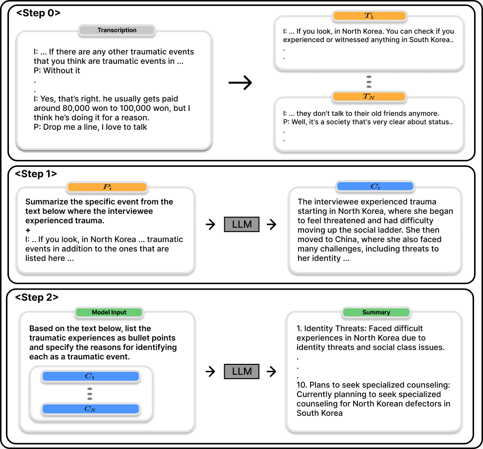
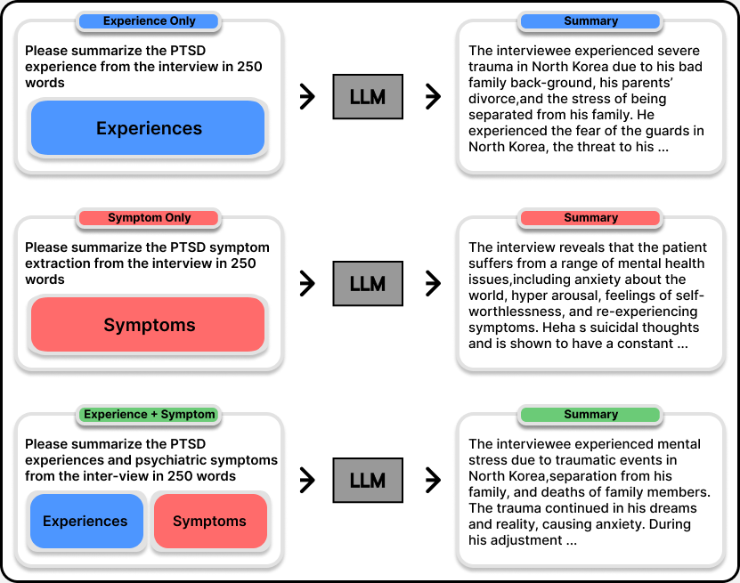
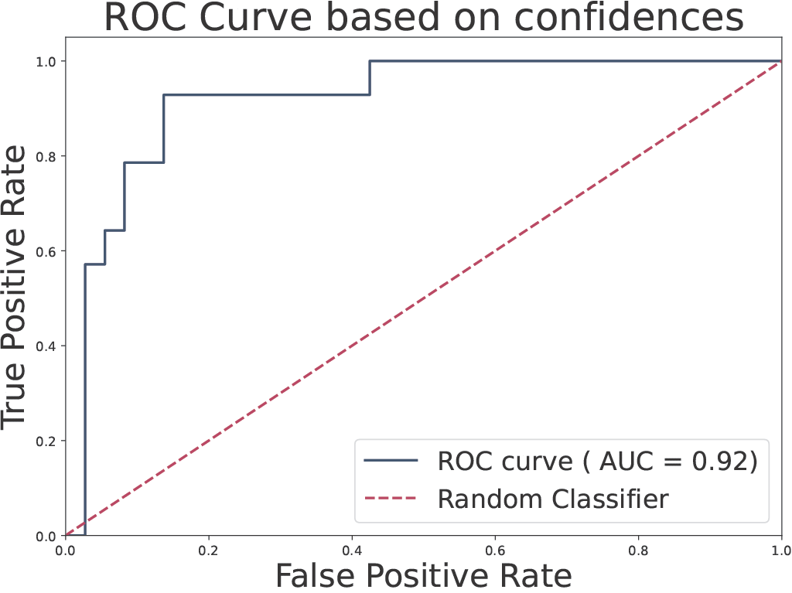

# Adapting GPT for Assisting Clinical Psychiatry Practice with Patient Interview Transcripts

Jy-yong Sohn, Jae-hee So, Joonhwan Chang, Eunji Kim, Junho Na, JiYeon Choi, Byung-Hoon Kim, Sang Hui Chu

This repository is the code implementation of paper *[Adapting GPT for Assisting Clinical Psychiatry Practice with Patient Interview Transcripts](https://openreview.net/forum?id=78TXBcyBB1)* 

## Abstract

Recent advancements in Large Language Models (LLMs) have accelerated their usage in various domains including healthcare, law, entertainment, to name a few. However, we have a lack of understanding on how to use LLMs for diagnosing mental health issues of patients. In this paper, we shed light on the intersection of mental health diagnosis and LLMs by conducting initial experiments. Specifically, we explore using LLMs for analyzing counseling data from North Korean defectors with mental health issues. We focused on the performance of LLMs on three sub-tasks: (1) extract key experiences and symptoms of the patients, (2) write summaries of patient cases, and (3) infer evidence of mental health problems, such as highlighting specific sections within the counseling data. To assist in the training of LLMs, we propose a novel technique involving mental health specialists in data labeling, which is shown to enhance the performance of LLMs. Our experimental results show that LLMs have high performance on three target sub-tasks, even in the zero-shot inference with appropriate prompting. This research contributes to the nascent field of applying LLMs to mental health diagnosis and demonstrates their potential effectiveness in aiding mental health practitioners.

<p align="center">
  
  <b>Procedure for Extracting traumatic expereiences of patient interview transcriptions</b>
<br><br>
  
  <b>Procedure for Summary using the traumatic experiences and symptoms</b>
<br><br>
  
  <b>ROC curve of GPT-4 zero-shot symptom prediction</b>
</p>

## Setting up an environment

We recommend that you run experiments in a virtual environment where you have installed all the necessary packages.
You may install the requirements using the requirements.txt file:
```
pip install -r requirements.txt
```
Please read the detailed manuals in each subfolder

## Data Format

We saved our initial training data in Excel file(.xlsx). The initial data consisted of 'Statement,' 'Symptom,' and 'Section.'<br>
```Statement``` One segment from the interview with the patient <br>
```Symptom```  Psychiatric symptoms related to PTSD labeled by mental health specialists. symptoms <br>
```Section```  Section with symptoms labeled by mental health specialists <br>
The table below is an example of that. Please use this example to create the data structure for conducting experiments in code.

| Statement | Symptom | Section |
| --------- | --------- | --------- |
| I:... Q:...  | re-experience  | ...coming out in my dreams... |

## Remind

### Estimated Section Accuracy

The calculation of estimated section accuracy using mid-token distance, as presented in the paper, is not accompanied by specific code due to duplicate interview paragraphs and exceptional cases. <br> 
Please refer to the paper for the method of detailed procedure to calculate mid-token distance.

### Fine-tuning

As mentioned in the paper, we fine-tuned GPT-3.5 to compare the performance of zero-shot and fine-tuned one. The data for fine-tuning was created using the 'merge_json' function from 'summarization/json_utils.py,' and the fine-tuning process was conducted with reference to *[OpenAI's Fine-tuning documentation](https://platform.openai.com/docs/guides/fine-tuning)*
