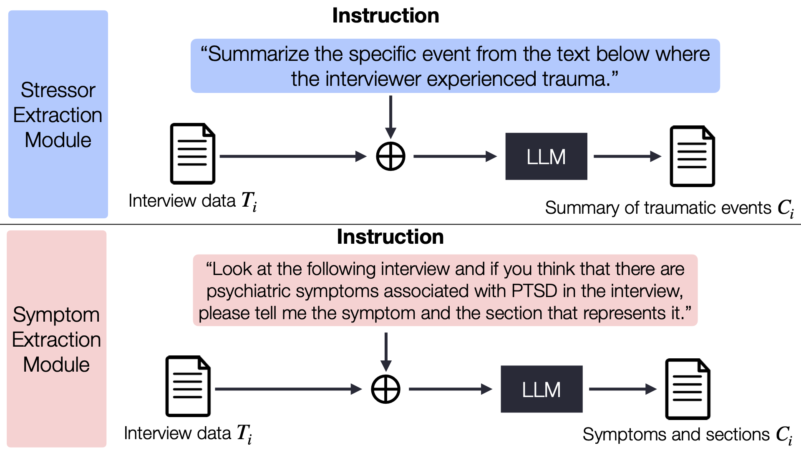

# Aligning Large Language Models for Enhancing Psychiatric Interviews through Symptom Delineation and Summarization : Pilot Study

Jae-hee So, Joonhwan Chang, Eunji Kim, Junho Na, JiYeon Choi, Jy-yong Sohn, Byung-Hoon Kim, Sang Hui Chu

This repository is the code implementation of paper *[Aligning Large Language Models for Enhancing Psychiatric Interviews through Symptom Delineation and Summarization : Pilot Study](https://formative.jmir.org/2024/1/e58418/)* 

## Abstract

Background:
Recent advancements in large language models (LLMs) have accelerated their use across various domains. Psychiatric interviews, which are goal-oriented and structured, represent a significantly underexplored area where LLMs can provide substantial value. In this study, we explore the application of LLMs to enhance psychiatric interviews by analyzing counseling data from North Korean defectors who have experienced traumatic events and mental health issues.

Objective:
This study aims to investigate whether LLMs can (1) delineate parts of the conversation that suggest psychiatric symptoms and identify those symptoms, and (2) summarize stressors and symptoms based on the interview dialogue transcript.

Methods:
Given the interview transcripts, we align the LLMs to perform 3 tasks: (1) extracting stressors from the transcripts, (2) delineating symptoms and their indicative sections, and (3) summarizing the patients based on the extracted stressors and symptoms. These 3 tasks address the 2 objectives, where delineating symptoms is based on the output from the second task, and generating the summary of the interview incorporates the outputs from all 3 tasks. In this context, the transcript data were labeled by mental health experts for the training and evaluation of the LLMs.

Results:
First, we present the performance of LLMs in estimating (1) the transcript sections related to psychiatric symptoms and (2) the names of the corresponding symptoms. In the zero-shot inference setting using the GPT-4 Turbo model, 73 out of 102 transcript segments demonstrated a recall mid-token distance d<20 for estimating the sections associated with the symptoms. For evaluating the names of the corresponding symptoms, the fine-tuning method demonstrates a performance advantage over the zero-shot inference setting of the GPT-4 Turbo model. On average, the fine-tuning method achieves an accuracy of 0.82, a precision of 0.83, a recall of 0.82, and an F1-score of 0.82. Second, the transcripts are used to generate summaries for each interviewee using LLMs. This generative task was evaluated using metrics such as Generative Evaluation (G-Eval) and Bidirectional Encoder Representations from Transformers Score (BERTScore). The summaries generated by the GPT-4 Turbo model, utilizing both symptom and stressor information, achieve high average G-Eval scores: coherence of 4.66, consistency of 4.73, fluency of 2.16, and relevance of 4.67. Furthermore, it is noted that the use of retrieval-augmented generation did not lead to a significant improvement in performance.

Conclusions:
LLMs, using either (1) appropriate prompting techniques or (2) fine-tuning methods with data labeled by mental health experts, achieved an accuracy of over 0.8 for the symptom delineation task when measured across all segments in the transcript. Additionally, they attained a G-Eval score of over 4.6 for coherence in the summarization task. This research contributes to the emerging field of applying LLMs in psychiatric interviews and demonstrates their potential effectiveness in assisting mental health practitioners.

<p align="center">
  
  <b>Overview</b>
<br><br>
  
  <b>Modules for extracting the traumatic stressors and symptoms</b>
</p>

## Setting up an environment

We recommend that you run experiments in a virtual environment where you have installed all the necessary packages.
You may install the requirements using the requirements.txt file:
```
pip install -r requirements.txt
```
Please read the detailed manuals in each subfolder

## Data Format

We saved our initial training data in Excel file(.xlsx). The initial data consisted of 'Statement,' 'Symptom,' and 'Section.'<br>
```Statement``` One segment from the interview with the patient <br>
```Symptom```  Psychiatric symptoms related to PTSD labeled by mental health specialists. symptoms <br>
```Section```  Section with symptoms labeled by mental health specialists <br>
The table below is an example of that. Please use this example to create the data structure for conducting experiments in code.

| Statement | Symptom | Section |
| --------- | --------- | --------- |
| I:... Q:...  | re-experience  | ...coming out in my dreams... |

## Remind

### Estimated Section Accuracy

The calculation of estimated section accuracy using mid-token distance, as presented in the paper, is not accompanied by specific code due to duplicate interview paragraphs and exceptional cases. <br> 
Please refer to the paper for the method of detailed procedure to calculate mid-token distance.

### Fine-tuning

As mentioned in the paper, we fine-tuned GPT-3.5 to compare the performance of zero-shot and fine-tuned one. The data for fine-tuning was created using the 'merge_json' function from 'summarization/json_utils.py,' and the fine-tuning process was conducted with reference to *[OpenAI's Fine-tuning documentation](https://platform.openai.com/docs/guides/fine-tuning)*
